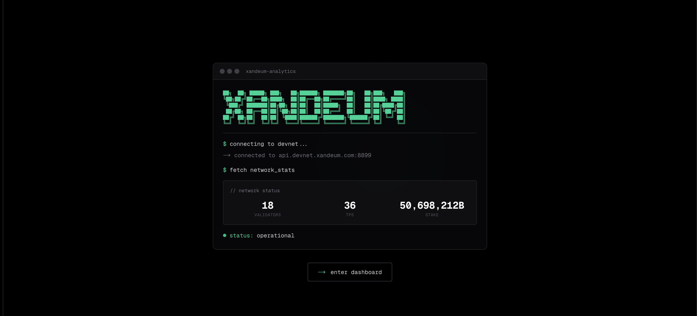
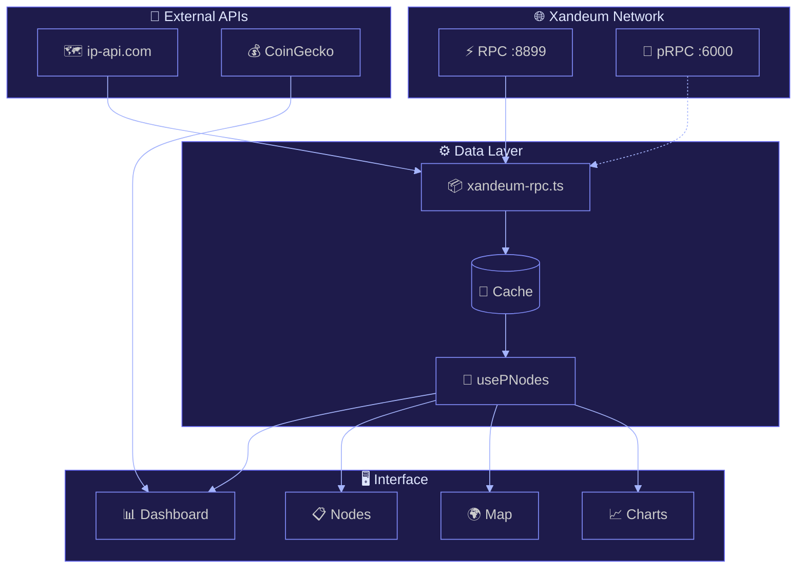

  

 

  <samp>real-time analytics for xandeum pnode network</samp>

  <a href="#how-it-works">how it works</a> •
  <a href="#data-flow">data flow</a> •
  <a href="#node-enrichment">enrichment</a> •
  <a href="#polling">polling</a> •
  <a href="#pages">pages</a>

---

## how it works

the dashboard connects directly to xandeum's devnet rpc at `api.devnet.xandeum.com:8899` using solana-style json-rpc calls. no mock data, everything you see is live from the chain.

---

## architecture

---

## data flow

- **getClusterNodes** — returns all nodes in gossip with pubkeys, software versions, and network addresses (gossip, tpu, rpc ports)
- **getVoteAccounts** — splits validators into `current` (actively voting) and `delinquent` (missed votes), includes activated stake and epoch credits
- **getProgramAccounts** — queries the config program (`Config1111...`) for on-chain validator metadata like names, websites, and icons
- **getEpochInfo** — provides current epoch, absolute slot, block height, slots remaining, and total transaction count
- **getRecentPerformanceSamples** — returns tps data with transaction counts per sample period

---

## node enrichment

each raw cluster node gets transformed into a full `PNodeMetrics` object:

- **status** — `Active` if pubkey in current vote accounts, `Delinquent` if in delinquent list, `Offline` otherwise
- **stake** — `activatedStake` from vote account converted from lamports to XAND
- **uptime** — calculated from `epochCredits` array, comparing earned credits vs max possible slots over last 5 epochs
- **geolocation** — ip extracted from gossip address, batch lookup via ip-api.com returns country, city, lat/lon, isp
- **credits** — total accumulated vote credits from the last entry in `epochCredits` array
- **commission** — validator's fee percentage taken from staking rewards
- **lastVote** — most recent slot the validator voted on, used to calculate heartbeat freshness

---

## polling

the `usePNodes` hook in `hooks/use-pnodes.ts` manages automatic data refresh:

- **interval** — fetches fresh data every 30 seconds via `setInterval`
- **caching** — rpc client caches responses for 10 seconds to prevent hammering the endpoint
- **status tracking** — maintains `connectionStatus` state (connected/connecting/disconnected/error)
- **change detection** — compares previous node states to current, fires callbacks when nodes go active → delinquent → offline
- **health alerts** — status changes populate the alerts panel with timestamps

### prpc (port 6000)

individual pnodes can expose a secondary rpc for detailed stats:

- `get-version` — pnode software version string
- `get-stats` — real cpu usage, ram used/total, storage bytes, packets in/out, active streams
- `get-pods` — list of known pods in the network with addresses and last seen timestamps

---

## pages

- **dashboard** — network overview showing active/delinquent validator counts, total staked XAND, current epoch with progress bar, live tps, and block height
- **nodes** — paginated table of all pnodes with search by pubkey, filter by status, sortable columns for stake/uptime/version, click through to detailed node view
- **map** — interactive 3d globe rendered with d3, nodes plotted by geolocation coordinates, hover for node info, shows geographic distribution of the network
- **charts** — historical line charts for tps, stake distribution, validator count over time, epoch performance metrics using recharts
- **about** — static page explaining xandeum ecosystem, pnode architecture, and how to run your own node

---

## license

mit

---

  <samp>built for the xandeum ecosystem</samp>

